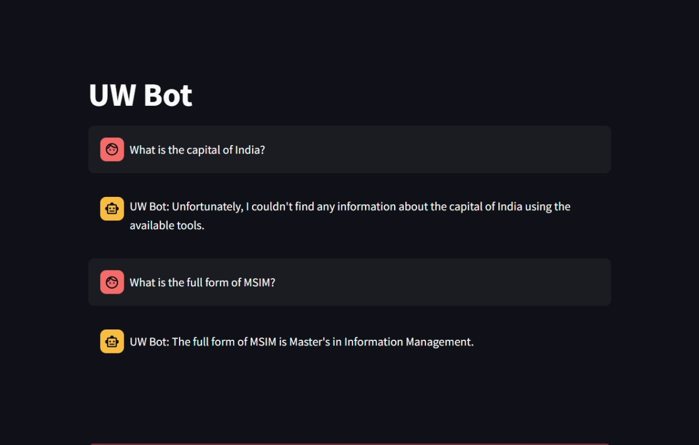

# University of Washington AI Chat Agent 

## Overview

This project is aimed at creating a Chat Agent that can respond to any queries related to the University of Washington using Generative-AI. Treating this as a RAG problem, we can extract all the information from the public websites of the University of Washington.

## Steps

- Web scrape all the websites from UW and save them locally
- Create a Vector Store of these webpages for querying
- Utilize OCTO AI's APIs for calling the LLaMa 3.1 70B Model for generating responses
- Create a chat interface using streamlit for the users.

## Demo

